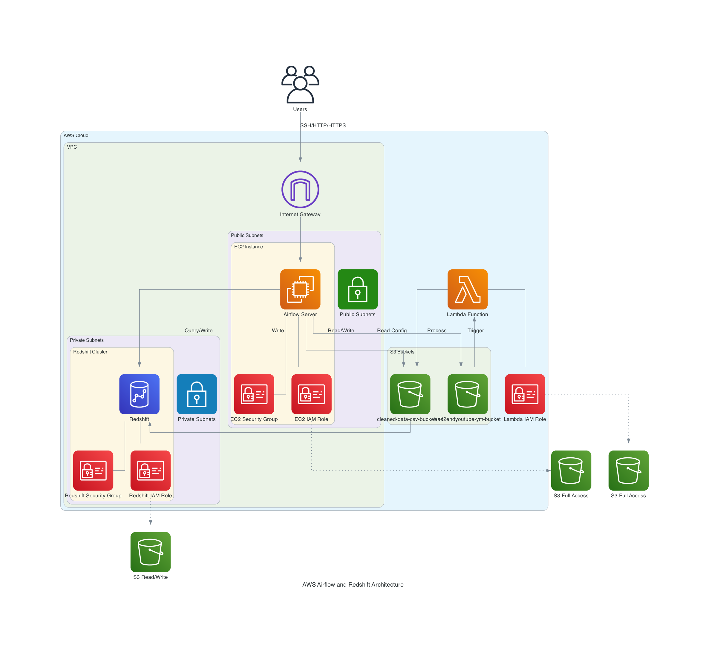

# AWS Airflow ETL Infrastructure (Terraform-based)

This project demonstrates the deployment of an end-to-end ETL (Extract, Transform, Load) pipeline using Terraform. It automates the provisioning of AWS services, including Apache Airflow for orchestration, to showcase my Terraform skills. 

> **Note:** This setup is not intended for production environments—the security groups and configurations are intentionally relaxed for demonstration purposes only. The main goal is to exhibit the ability to manage and deploy a functional ETL pipeline using Terraform.

## Infrastructure Components

### VPC and Networking
- Terraform provisions a custom VPC with public subnets across multiple availability zones.
- Includes an Internet Gateway to enable public internet access.
- Configures route tables and associations.
- **Security settings** here are simplified for demonstration purposes and should not be used in production.

### EC2 Instance for Airflow
- A `t2.medium` EC2 instance running Apache Airflow, deployed via Terraform.
- Security group allows SSH, HTTP, HTTPS, and Airflow webserver access. 
  - For the sake of showcasing the setup, security is relaxed, but it would be more restrictive in a real-world, production environment.
- IAM roles and policies are provisioned using Terraform to grant the EC2 instance access to S3.

### S3 Buckets
- Terraform configures S3 buckets to store raw and processed data.
- One bucket stores raw data extracted from Zillow’s API, while the other holds cleaned data.
- Airflow DAGs are copied from a public S3 bucket that I’ve created.

### Redshift Cluster
- Terraform provisions a 2-node `dc2.large` Redshift cluster for data warehousing.
- A security group is applied, allowing access from the Airflow EC2 instance. 
  - As this is a showcase, the security group is intentionally lenient.
- IAM roles are also handled by Terraform for Redshift’s access to S3.

### Lambda Function
- Terraform deploys an AWS Lambda function, triggered by S3 events when new data is uploaded.
- The Lambda function uses a custom Python runtime (with Pandas support) to transform the raw data into a cleaned format.
- Lambda has full S3 access, with permissions managed by IAM roles created through Terraform.

### IAM Roles and Policies
- Terraform manages all IAM roles and policies required for EC2, Redshift, and Lambda to interact with S3.

## Architecture Overview
1. **Data Extraction**: Airflow, provisioned via Terraform, manages the data extraction from the Zillow API. Airflow handles the orchestration of tasks in the correct sequence.
2. **Data Storage**: Raw JSON data is stored in S3, a scalable storage solution provisioned through Terraform.
3. **Data Transformation**: A Lambda function (also created by Terraform) is triggered by S3 events and transforms the data from JSON to CSV.
4. **Data Loading**: Airflow loads the cleaned data into Redshift, another component deployed via Terraform.
5. **Data Visualization**: Although not covered in this project, Redshift data could be visualized using services like Amazon QuickSight.

## Important Note
Security settings and access controls within this project are intentionally relaxed to showcase my capabilities with Terraform. For a production environment, stricter security practices, such as more restrictive security groups, multi-layer access control, and hardened IAM roles, would be necessary.
